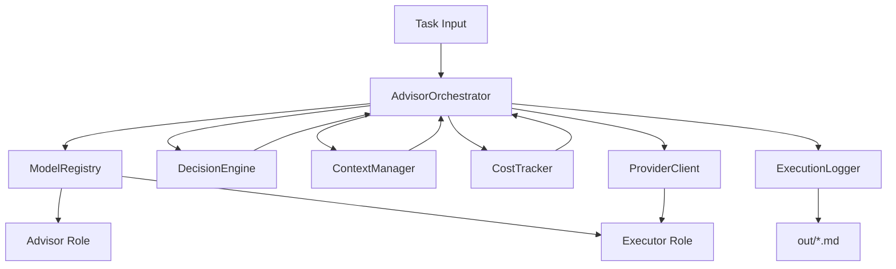
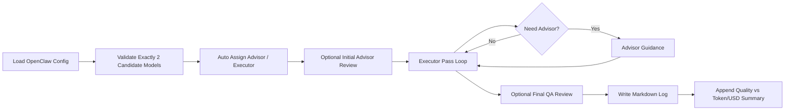
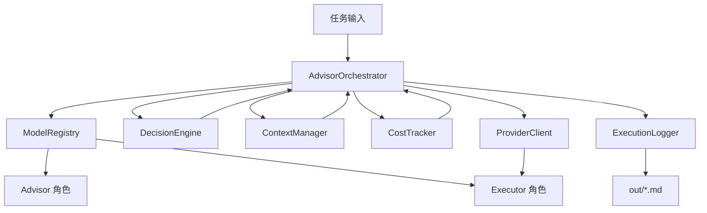
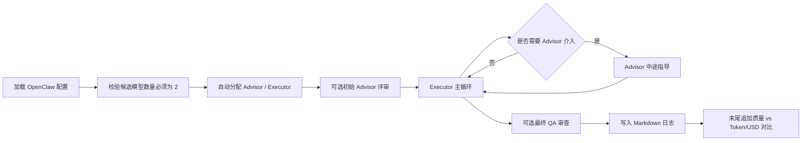

# Advisor Claw Skill

Status: `local validation: passed` | `smoke test: ok` | `license: MIT` | `runtime: Node.js CommonJS` | `config: OpenClaw JSON5 official` | `docs: English + 中文`

Professional OpenClaw skill scaffold for a budget-aware advisor/executor workflow.

## Navigation

### English

- [Overview](#overview)
- [What Is Actually Implemented](#what-is-actually-implemented)
- [Key Behaviors](#key-behaviors)
- [Architecture](#architecture)
- [Runtime Flow](#runtime-flow)
- [Directory Layout](#directory-layout)
- [OpenClaw Configuration Sources](#openclaw-configuration-sources)
- [Validation](#validation)
- [Notes And Precautions](#notes-and-precautions)
- [Current Scope](#current-scope)
- [License](#license)

### 中文

- [中文部分](#中文)
- [概述](#概述)
- [已真实实现的能力](#已真实实现的能力)
- [关键行为说明](#关键行为说明)
- [架构图](#架构图)
- [运行流程简图](#运行流程简图)
- [目录结构](#目录结构)
- [OpenClaw 配置来源](#openclaw-配置来源)
- [验证方式](#验证方式)
- [使用注意事项](#使用注意事项)
- [当前范围](#当前范围)
- [许可证](#许可证)

---

## English

### Overview

Advisor Claw Skill is a production-oriented OpenClaw scaffold that implements a two-role orchestration pattern:

- a lower-cost executor handles the main task loop
- a stronger advisor is invoked only when task complexity, uncertainty, execution pressure, or stagnation justify the extra cost

This repository is not a mock design note anymore. It reflects the result of multiple rounds of review, correction, runtime hardening, and smoke-test validation.

### What Is Actually Implemented

The current implementation includes real, validated behavior instead of placeholder documentation:

- strict two-model workflow: the skill requires exactly 2 candidate models
- automatic role assignment: the stronger model becomes advisor, the better price/performance model becomes executor
- OpenClaw config discovery from official config surfaces
- official JSON5 config parsing for `~/.openclaw/openclaw.json`
- optional project-level merge with `openclaw.config.json`
- `$include` support within the config boundary
- configured-model reuse when a model or provider already exists in OpenClaw config
- external model support when the user explicitly provides an API key
- bounded recovery ladder: executor 3 attempts, advisor 2 attempts, then structured failure
- markdown execution logs written to `out/`
- end-of-run quality vs resource comparison in the markdown log footer
- executable smoke test covering orchestration, config loading, recovery, and logging

### Key Behaviors

#### Model Selection Rules

- Exactly 2 candidate models must be provided.
- If the candidate already exists in OpenClaw config, the skill reuses it.
- If the candidate is not configured in OpenClaw, an API key is required.
- If neither condition is met, the run fails early with a configuration error.

#### Execution Rules

- The advisor can be called at initial planning, during execution, and for final quality review.
- Advisor escalation is controlled by a weighted decision engine instead of a single threshold.
- The cost tracker records token and USD usage by role.
- The execution logger persists timeline events and a final summary.

#### Failure Rules

- Executor retries up to 3 times.
- Advisor repair attempts up to 2 more times.
- If recovery still fails, the orchestrator throws a structured `AdvisorRuntimeError` with cause and stack trace.

### Architecture



### Runtime Flow



### Directory Layout

```text
advisor-manager-skill/
├── SKILL.md
├── README.md
├── LICENSE
├── package.json
├── package-lock.json
├── config/
│   ├── default.yaml
│   ├── roles.yaml
│   ├── strategies.yaml
│   └── model_catalog.example.yaml
├── references/
│   ├── conversation-setup.md
│   └── design-review.md
├── scripts/
│   ├── advisor_orchestrator.js
│   ├── context_manager.js
│   ├── cost_tracker.js
│   ├── decision_engine.js
│   ├── execution_logger.js
│   ├── index.js
│   ├── model_configuration_error.js
│   ├── model_registry.js
│   ├── openclaw_config_loader.js
│   ├── provider_client.js
│   ├── runtime_error.js
│   └── smoke_test.js
└── templates/
```

### OpenClaw Configuration Sources

The runtime currently targets the official OpenClaw config layout:

- `OPENCLAW_CONFIG_PATH`
- `~/.openclaw/openclaw.json`
- project-level `openclaw.config.json`

The loader understands these official structures:

- `models.providers`
- `models.providers.*.models[]`
- `agents.defaults.models`
- `agents.defaults.model`
- `agents.list[].model`
- JSON5 comments and trailing commas
- `$include` expansion inside the config root

### Validation

Install dependencies:

```powershell
npm install
```

Run the smoke test:

```powershell
node .\scripts\smoke_test.js
```

Run syntax checks:

```powershell
node --check .\scripts\openclaw_config_loader.js
node --check .\scripts\execution_logger.js
node --check .\scripts\cost_tracker.js
node --check .\scripts\advisor_orchestrator.js
node --check .\scripts\smoke_test.js
```

### Notes And Precautions

Please read these before using the skill:

1. This repository is a hardened scaffold, not a full provider-integrated production service.
2. The skill assumes exactly 2 candidate models. Zero, one, or more than two is a hard configuration error.
3. OpenClaw-configured providers are reused only when discovery succeeds from official config structures.
4. Unconfigured external models must provide API-key metadata explicitly.
5. The generated markdown logs may contain task content, warnings, and stack traces. Do not treat `out/` as automatically sanitized public output.
6. The quality score in the log footer is an orchestration-side heuristic for runtime assessment, not a universal benchmark.
7. `$include` resolution is intentionally restricted to the config root boundary.
8. The repository currently keeps `package.json` as `private: true`; MIT licensing here expresses source usage terms, not package publication intent.

### Current Scope

Included now:

- orchestration logic
- model validation and role assignment
- official-style OpenClaw config loading
- bounded recovery
- markdown execution logging
- cost and token accounting
- bilingual documentation

Intentionally left open:

- real provider SDK integration
- persistent storage backend
- deployment packaging
- live OpenClaw gateway automation hooks

### License

This project is licensed under the MIT License. See `LICENSE` for details.

---

## 中文

### 概述

Advisor Claw Skill 是一个面向 OpenClaw 的生产导向型技能脚手架，实现了双角色协同模式：

- 低成本执行模型负责主要任务循环
- 只有在复杂度、不确定性、执行压力或停滞程度值得额外成本时，才调用更强的顾问模型

这个仓库现在不再只是设计草案，而是经过多轮复盘、纠偏、运行时加固和 smoke test 验证后的实际结果。

### 已真实实现的能力

当前实现的是可运行、已验证的功能，而不是占位描述：

- 严格双模型约束：技能要求且只接受 2 个候选模型
- 自动分角：更强的模型担任 advisor，更优性价比模型担任 executor
- 按 OpenClaw 官方配置结构进行模型发现
- 支持解析 `~/.openclaw/openclaw.json` 的官方 JSON5 配置
- 支持与项目级 `openclaw.config.json` 合并
- 支持配置根目录内的 `$include`
- 当模型或 provider 已存在于 OpenClaw 配置中时直接复用
- 当模型未配置于 OpenClaw 时，允许通过显式 API Key 接入
- 固定恢复阶梯：executor 3 次，advisor 2 次，然后抛出结构化异常
- 将执行过程写入 `out/` 下的 markdown 日志
- 在 markdown 日志末尾追加“执行质量 vs 资源消耗”对比摘要
- 使用 smoke test 验证编排、配置加载、恢复链路和日志输出

### 关键行为说明

#### 模型选择规则

- 必须提供且只提供 2 个候选模型。
- 若候选模型已存在于 OpenClaw 配置中，则直接复用。
- 若候选模型未在 OpenClaw 中配置，则必须显式提供 API Key 信息。
- 若以上条件都不满足，则在执行前直接抛出配置错误。

#### 执行规则

- advisor 可以在初始规划、中途指导和最终质量审查三个阶段介入。
- 是否升级 advisor，由加权决策引擎判断，而不是单一阈值。
- 成本追踪器按角色记录 token 与美元消耗。
- 执行日志会保存完整时间线和最终总结。

#### 失败规则

- executor 最多重试 3 次。
- advisor 最多继续修复 2 次。
- 若仍无法恢复，编排器会抛出带 cause 和 stack trace 的结构化 `AdvisorRuntimeError`。

### 架构图



### 运行流程简图



### 目录结构

```text
advisor-manager-skill/
├── SKILL.md
├── README.md
├── LICENSE
├── package.json
├── package-lock.json
├── config/
├── references/
├── scripts/
└── templates/
```

### OpenClaw 配置来源

当前运行时针对的是 OpenClaw 官方配置布局：

- `OPENCLAW_CONFIG_PATH`
- `~/.openclaw/openclaw.json`
- 项目级 `openclaw.config.json`

当前 loader 能识别这些官方字段：

- `models.providers`
- `models.providers.*.models[]`
- `agents.defaults.models`
- `agents.defaults.model`
- `agents.list[].model`
- JSON5 注释与尾随逗号
- 配置根目录内的 `$include` 展开

### 验证方式

安装依赖：

```powershell
npm install
```

运行 smoke test：

```powershell
node .\scripts\smoke_test.js
```

运行语法检查：

```powershell
node --check .\scripts\openclaw_config_loader.js
node --check .\scripts\execution_logger.js
node --check .\scripts\cost_tracker.js
node --check .\scripts\advisor_orchestrator.js
node --check .\scripts\smoke_test.js
```

### 使用注意事项

使用前请注意：

1. 这是经过加固的技能脚手架，不是已经完成所有 provider 接线的正式服务。
2. 技能严格要求 2 个候选模型；0 个、1 个或超过 2 个都会直接报错。
3. 只有在官方配置结构中发现成功时，才会复用 OpenClaw 已配置的模型或 provider。
4. 对于未配置的外部模型，必须显式提供 API Key 元数据。
5. `out/` 目录中的 markdown 日志可能包含任务内容、告警和堆栈信息，不应默认视为可公开分发的脱敏产物。
6. 日志末尾的质量评分是编排层的运行时启发式评估，不是通用 benchmark 分数。
7. `$include` 的解析被限制在配置根目录边界内，这是有意的安全约束。
8. 当前 `package.json` 仍为 `private: true`；MIT 协议表达的是源码使用许可，不等同于已经开放 npm 发布。

### 当前范围

目前已经包含：

- 编排逻辑
- 模型校验与自动分角
- 官方风格 OpenClaw 配置加载
- 有界恢复机制
- Markdown 执行日志
- token 与美元消耗统计
- 英中双语文档

当前仍然有意留空：

- 真实 provider SDK 接线
- 持久化存储后端
- 部署打包
- 与真实 OpenClaw gateway 的自动化集成钩子

### 许可证

本项目采用 MIT 开源协议，详见 `LICENSE` 文件。